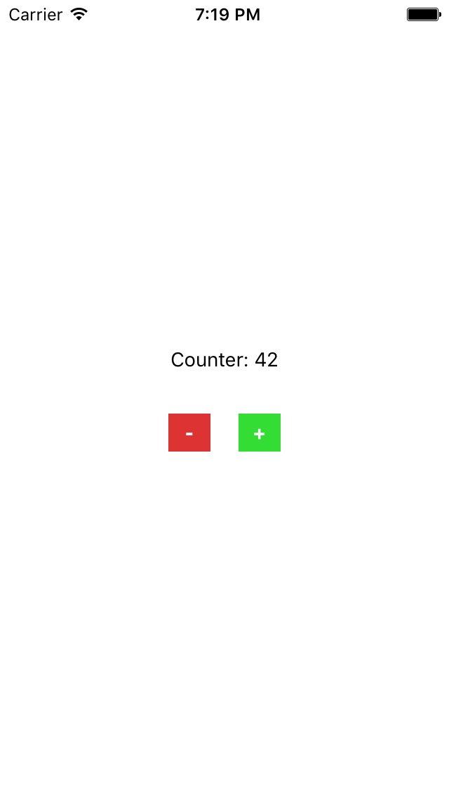
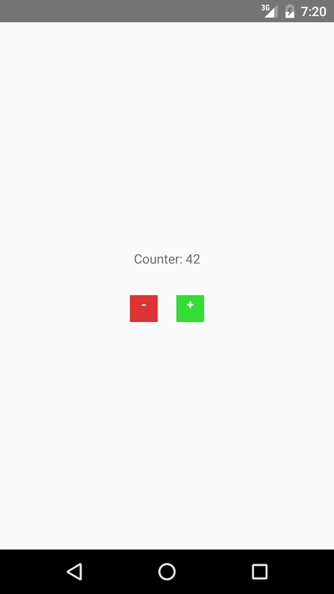

# Elm Native UI [](https://circleci.com/gh/ohanhi/elm-native-ui/tree/master)


Experimental support for writing native iOS and Android applications in the beautiful functional [Elm language](http://elm-lang.org/).
This project builds on Facebook's [React Native](https://facebook.github.io/react-native/), using it as the JavaScript environment for Elm.

## Frequently Asked Questions

### Is This Production Ready?

No. This is all very experimental and work in progress.

### Why React Native?

Mobile applications are expected to look and feel at home on the device and the OS it is running. This goal cannot really be achieved with a WebView-based solution (such as Cordova). React Native applications use the same pieces of UI as an app built with Objective-C or Java, choosing the platform-specific native variant of the UI feature for you.

### Will it always be React Native?

In the long term, not necessarily. The ultimate goal would be for Elm Native UI to be a standalone project, complete with the mobile platform groundwork that has been put into React Native already. It has not been fully assessed how much work this would in reality entail.


## Get it running


### Caution: Experimental software!

The newest version of Elm Native UI is using an alpha release of Elm, but it no longer depends on a modified compiler and core.

### Actually getting it running

Install React Native following [their guide](https://facebook.github.io/react-native/docs/getting-started.html#content). Check that you can create a new project:

```bash
$ react-native init MyAppName
```

and try running it on a real or virtual device.

Once that works, clone this repository in the same directory where you ran `react-native init` in. You should have a directory structure similar to this:

```
│
├── elm-native-ui
└── MyAppName
```

Go ahead and copy the files from the [`examples`](examples) in your React Native app directory now.

Now try to compile the Elm code with

```bash
$ npm run compile
```

This will create the `elm-package.json` and `elm-stuff` for you, even though it won't compile yet.

Edit the `index.*.js` files' last lines in case your React Native app is not called 'MyAppName' at this point. You may also need to rename the project in the `package.json` file.

We will then use [elm_self_publish](https://github.com/NoRedInk/elm-ops-tooling#elm_self_publish) to publish the Elm Native UI package into our project.

Assuming we're in the parent directory where `elm-native-ui` reside:

```bash
$ python path/to/elm_self_publish.py ./elm-native-ui ./MyAppName
```

Now we are ready to rock! 🤘🎸

Just to list out the basics:

```bash
# install dependencies
$ npm install
# compile Elm with
$ npm run compile
# run app on iOS
$ react-native run-ios
# or run on Android
$ react-native run-android
```

When you make changes to the code, you only need to recompile Elm and press Cmd-R on the Simulator (iOS) or refresh the emulator (Android).

If you wish, you can also start a file watcher for \*.elm files, which will recompile whenever you make a change:

```bash
$ npm start
```


## How it works

This section was outdated, but for an overview of the older structure, read this blog post: [Elm Native UI: Writing a React Native app in Elm](http://ohanhi.github.io/elm-native-ui.html)

You can also watch this [ElmCast Live episode](https://www.livecoding.tv/elmcast/videos/JjbOK-elmcast-live-2), where @ohanhi explains some of the differences between the old and the new versions. (You can safely skip the first 5 minutes, as we had technical issues in the beginning.)


## Screenshots

iOS | Android
----|--------
 | 

## To Do

- [x] Basic PoC
  - [x] Show something from Elm
  - [x] Make basic VTree work
  - [x] Add some kind of event handlers
- [x] Library
  - [x] Make `main` support our VTree ([see this suggestion](https://github.com/ohanhi/elm-native/commit/0a35edeb0c21985394b6f3b296140da431aa936c#commitcomment-14303291))
- [ ] Styles
  - [x] Basic types for styles
  - [x] Support object type styles - _transform styles and `shadowOffset`_
  - [x] Make enum type styles safer
  - [ ] Allow the `StyleSheet.create` method for styles
- [x] Props
  - [x] Improved event handlers
  - [x] Support props besides styles and event handlers
  - [x] Unify syntax for styles, handlers and other props
- [ ] Core features
  - [x] Navigation (NavigationExperimental)
  - [ ] Tasks (HTTP calls, storage)
  - [ ] UIExplorer / Component examples

## License

[BSD (3-clause)](LICENSE)
